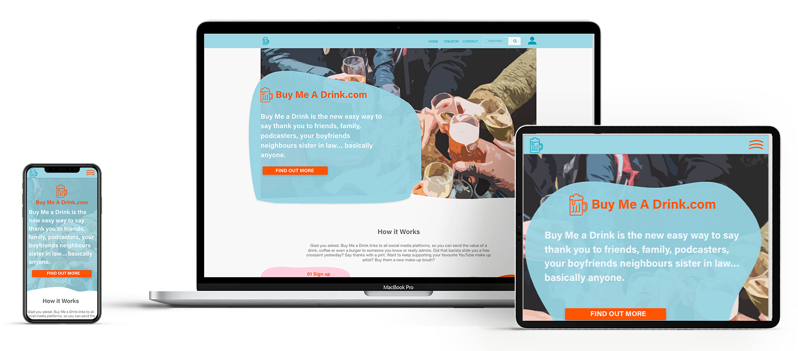

# README for Beer.com 

## Intro
This website has been developed for a new start-up called, But Me a Beer.com. The Founders core goals for the website are:

- To get the brand out to potential users of the service
- To get an indecation of the popularity of the idea
- To lead generate for potential content creator partners
 

 
[live site]()

## index

## The Website Brief

This is a copy of the [brief](assets-readme/Website%20Guideline.pdf)

### Target Visitors

There are two potentila audiances who will be visiting the website:

- Genral users(users), who would be large groups of users who would be looking to use the platfom to gift value amounts to other users.
- Content Creators(creators), these visitors to the website would be interested in using the service provided by the compnay to further monetize the sicail media content the already create.
  
## Goals for each audience
### Users
  - to gauge interest if this idea could be popular and potentially have a large user base. Potentially tracking this via Website hits and social media activity.

### Creators 
- to gauge the interest of anyone who is currently or thinks about making money from creating content on social media. To try and get contact information from this user group, primarily by email and secondly via social media contact.

## Inspiration

Websites that are described to the clients as there competition are

[BuyMeACoffee](https://www.buymeacoffee.com/)

[Patreon](https://www.patreon.com/)

[Just Giving](https://www.justgiving.com/)

## Summary of the brief

To hit the goals of the website, it needs to be clean clear and simple layout so the visitor can foucus and take in quickly the nessesary informatino and content on the website. 

Three pages one for each visitor audince and a contact page, with a form that is easily accesible from anywher in the website.

Multipule call to actions and links to make interaction with the visitors and the clients as easy as possible

Section on the website which are clear in their goal and delivar the nesesarry information, with nothing on the website without a perspouse.

To stick to the brand guildlines for colours and feel of the brand. Relaxed, friendly and inviting.

# UX 

## User jerourny

This is an example of a sucsesfull user jeroiny for both audiances

### User
- Has been directed to the hero section of the home page from a advertising link on social media.
- Looking for more information about the service that the company provides.
- Once seeing the Basic concept of the company, I need some more detailed information.
- Now that I have some more information I would like to get in contact with the company to find out more and express interest in using the service further down the line.
- Follow social media links.

### Creator 
- I have followed a link through my platform or via email, as I am looking to increase the revenue that I make from my content.
- This company can help me do that.
- This seams pretty straight forward.
- I can get in contact wit the comapny in hope that they can help me make more money.

I could see that the most popular screen sizes for desktop, with 40% of users, 

## Sections of the Website

### General layout

After reasearching what size I should format the webiste to, while taking into the user profiles and user goals. As the Creators are the primary revenue target for the client and they will be most likely viewing from desktop size screens. Looking at [statcounter](https://gs.statcounter.com/screen-resolution-stats/desktop/worldwide)

-1920x1080px

-1366x768px

I decided to adopt these gudlines throught the website, with a formatted width of 1366px and a height for the linked hero section of 768px. 

Also taking into account that 55% of websites viewed through mobile and knowing that the clients is using social media advertising to target possible users it was important that the wedbite is fully responsive and has been designed to look appealing and also to achive the goals set out.

The overall design of the website must also stick to the brand guidlines and colours. It was important to the client to get the feel of the comapny accross in design. Throught the brand colours and through the design. Something that feels relaxed friendly and modern, so trying were possible to not use straight lines and a ridged structure and layout of the website. But also trust worthy as they will be taking sesitive details from users, so everything has to work, and also not seem messy and childish.

## Navigation bar

The navigation bar must be accesibly throughout the website and have sections to navigate to clearly marked and easy to understand.

## Landing/Creator page

The pages for each of the audinsce groups should be consistant in layout and flow were possible. 
 
### Hero Section

The landing section needs to have a clear and informative, this must not have too much text to read, and consistant over all the pages of the site. With the goal for users to understand the business within the first 10 seconds of landing on the page. This must have a call to action on the button which will give the visitor the ability to get in contact with the founders, for more information. 

### Information/How to section

A key requirement is to inform the user of how they can sign up and use the service, therefore a clear section dedicated to this is needed next. This section must very very simple and not cluttered with lots of images and text. With the aim in mind just to simply give the user a little more information and not overwhlem. We want the user to want to get to the bottom of the page.

### Future feature section

Once the user has got to this point they should have a good understanding of the service that is being offered by the company. The next section should go into more detail about how the finished product will look. With most of the features set out in a manner that is easy to understand, from a quick glance. With a call to action button to try and get the visitor to make contact.

### Footer

Like the Hero section this will be consistant throught the website.This should be a clear section that will also be used to promote the social links the company. By this point in the joernoy the visitor should have enough informatin to know what the servic the company is trying to provied. So they can make an informed desicion on wheather it is somthing that they would be interested in. So it is important that the website makes it very easy for them to achvive the indevidual audiances goal. So we will have links to social in the middle of the footer section and driect email contact either side. 

### Form section

This should be clear to understand and not asking anything more than the basic information to give the cleint a lead to chase up.

## Basic Wireframes

Here is a sample of the original wireframes for the desktop that was sign of by the client to be branded

Other wireframes are [here](assets-readme/xd/Blue/Beer-Wireframes.xd)

# Design

As expressed in the Website brief, the brand structure has been agreed by the client already.

## Fonts

### Main copy

-Noto Sans JP and as a back up sans-serif

### Heading copy

-Acumin Pro and as a back up of serif;

## Imagery and Style

The style of the website needs to be clean, with plenty of white space which will give it a modern feel. Using the brand colours through the flow of the website, as this will be the first bit of marketing copy that the user will be exposed to. It is important to get the visitor used to the colour scheme straight away. Having a none traditional and abstract theme to the website led us to use some interesting design choices. Instead of using clean traditional photos, we are using imagery that has gone through cartoon filters to give the website an abstract feel, also I have stayed away from using straight uniformed shapes. Using colors and shapes to force the eye of the user to the part of the page where the information that the client wants them to know. 

To follow on with the ‘none confirmatory’ style of the website the heights of the sections will not be rigid throughout the pages, other than the hero sections the height will vary in size. Still with the screen height of 768px, so there will be very clearly defined sections to be viewed. This will give the users a feeling that the company is relaxed and friendly. 

The biggest challenge to the design brief with this project was to walk the line between having something purposefully designed in a way to be friendly and less formal. Without looking messy, unconsidered and potentislly childish. 

### Main colours

Brand colours are 

Example of the branded wireframes:

More wireframes can be found [here](assets-readme/xd/Branded/Beer.com-HF.xd)

## Features for the website

### Resposive design on all divices 

- Website must be responsive.

### Intereactive pages

- Visitors must be able to navigate between pages.

### Links to email contacts

- Visitors must be able to email and contact the clients.

### Links to social media

-Visitors must be able to link to the companies social media pages

## Technologies Used

### Languages

HTML5 - I used HTML 5 for the layout and structure of the website.

CSS - CSS has been used to style the HTML5 elements

## Architecture - SCSS

As I am coding different pages with many reused elements throughout the website, which could potentially also need individual formatting tweaks I decided to use a CSS Preprocessor on this project. 

Using the import feature of SCSS would first allow me to structure the architecture of the project in a much cleaner way. This style of architecture allows for smaller files that can be easily connected. 

Also allowing the use of variables makes the upkeep of the website much smoother, and also helps greatly with the responsive design. Giving the option to just change the variable and this will change every time that variable has been used throughout the code.

Using the nesting feature of SCSS allows for cleaner code making upkeep and bug fixes easier to locate and maintain.

## VS Code

I used VS Code as my code editor. In the code editor, the extensions that I used were:

- Prettier - to automatically format my code for any basic formatting mistakes and to have a consistent style throughout the code.
- Npm - I used this extension to give npm support for the version of VS Code I have.
- Image preview - I used this extension that shows a preview of any linked images in my code to help me quickly see if the URL path is correct and to the right image.
- Markdown all in one - I used this so I could edit the readme file with live preview in VS Code.

## Node modules

I used basic node modules to help me code in a smoother and more organised mannor.

- Devsever - I used the dev server module to live to reload my project, on a change of the code. This made it easier to see changes that I am making to the code.

- Node-sass - I used this to node so I could use the SCSS file and architecture.

- Watch sass - I used this module to compile the SCSS structure and architecture that I was using into a CSS format.

- Autoprefixer - I used this extension to add prefixes to my code for added browser support.
  
- Font Awesome - I used this extension to intergrate some free icons into the page.

## Outside libraries

- Unsplash images - I used this library for the hero image on the website.

- Adobe font Typekit - I used Adobe font library for the font family on the website.

- Google fonts - I used the google fonts for one of the font families on the website

## CSS Pseudo-classes

- Hover: I used the hover class to change the state of various items over the page, all buttons, and icons. This helps identify to the website visitor that the user can interact with this object.

- Active: I used the active class to change some CSS properties of an object to indicate to the visitors that this object has been interacted with.

- Focus: I used the focus class to help potential visitors to the website who need extra accessibly help to navigate through the website.

- Target: I used the target class to activate the modal on the interaction of the profile icon.

## Software Used

- Git - Was used to managing the different versions of my project and used different branches to test and to add new features/sections to the website. Once these have been tested they are then merged into the master branch and then using Git Desktop pushed to the Git Hub repository.

- Git Desktop - I used this to easily manage commits and oush them to the GitHub repository 

- GitHub - I used GitHub to store the version of the project remotely.

- Adobe XD - I used XD to create and build the wireframes, to design some of the unique icons on the page and the unique color patterns on the page.

- Photoshop - I used photoshop to edit the hero image on the page, I used some filters on the image to create the cartoon effect on the image.

## Online resources

### [W3 Schools](https://www.w3schools.com/)
### [Stack Overflow](https://stackoverflow.com/)
### [Code Pen](https://codepen.io/)
### [npm](https://www.npmjs.com/)
### [MDN](https://developer.mozilla.org/en-US/)

# Testing

## Automated Code validation

I passed the code through the online code checking tool [w3validator](https://validator.w3.org/)

- Html Code has passed through the validator with no issues.

- CSS code passed through the validator with no issues - I have three warnings that I believe are necessary for the website to run. Two are around importing the fonts into the stylesheet. The other is a warning around using pointer-events, which I need to be able to close the modal. 

### Chrome DevTools 
 
 I run an audit on all pages mobile and desktop

- ### Performance = Good
	This test was well performing across all sites and pages scoring 100 on a desktop on 96 across the mobile pages.

- ### Accessibility = Good
    This test was also well-performing, with 90 on mobile and 92-93 across the desktop pages, being marked down on the font awesome icons imported for the footer using [aria-hidden=” true”]. I researched to see if this was something that I could change, I could not find a solution to this. Also, the score was marked down due to there being a lack of contrast between foreground colors and background. This is down to a design decision that I am reluctant to change. The areas picked out with this issue I checked and believe there is sufficient contrast there for the users to understand the text.

- ### Best Practices = Good
    High performing across all pages and formats, 93 and above. Made down due to an incorrect aspect ratio of an icon, after looking at the icon I believe this is not an issue to be delt with. The aspect is .09% out on a small icon that is sized to fit in place on the center grid. 

- ### SEO = Good 
    100 on all pages both desktop and mobile.

## Manual testing

### Testing Environments

I used branches in Git to try and create a safer environment to develop different features and sections of the website. Once the initial section/feature had been finished then the initial test had been completed, the branch would then be merged with the master branch. Initially, I would delete the branch but after speaking with my mentor I decided to keep them for reference.

I used two sets of hardware to undergo building and the testing of the website. A 28 inc Imac and a 13inch Macbook air with the M1 processor. On both, I was primarily using the Google Chrome web browser. Testing on other environments has been made remotely, with the pandemic I have not been able to use other people’s equipment to test on.

### Desktop testing:

platforms :

- Mac book air 2020 M1 -OS Big Sur
- iMac - OS Catalina

Borwsers:

- Chrome
- Firefox
- Safari

Mobile testing:

- Pixel 3 (Android 11)
- iPhone 7 (IOS 14)

Browsers:

- Chrome
- Safari

## Testing - Design Responsiveness

### Simulated testing

For each section on each page, I tested various screen sizes in the development environment. Using the Google Developer tools I tested the responsiveness the whole way through the development process. Updating the code as I noticed anything that was not quite right with the layout of the page.

Tested with Chrome DevTools using profiles for with screen sizes:
- Moto G4
- Galaxy S5
- Pixel 2
- Pixel 2 XL
- iPhone 5 SE
- iPhone 6/7/8
- iPhone 6/7/8 Plus
- iPhone X
- iPad
- iPad Pro

Also used the responsive profiles preset in the dev tools of:
- Mobile S (320px)
- Mobile M (375px)
- Mobile L (425px)
- Tablet (768px)
- Laptop (1024px)
- Laptop L (1440px)

### User testing

To test if the layout of the website would hit the Client’s goals. I got two sets of 5 brand new users to use the website. One group as the user-focused group and one for the creator focus group. The overall results of this are as follows. 

### User Tests

- What did most users remember about the business after the 5-second showing?

        The constant feedback was that the company is around gifting drinks or meeting up with friends and family. 
- What did users remember about the signup process?
        
        Everyone recognized that you can sign in through social media platforms. 
- After asking the Creator to try and contact the company, how did they get on? Could they find the Social Media links

        All got to the page very quickly, one user got ‘stuck’ for a little while on the top one the page, all others scrolled down to the form very quickly.

        Socail media links were found by all users within 10 seconds of the question being asked.

### Creator Tests

- What did the test subject remember after 5 seconds on the hero section of the creator page?

        Something about earning more money from content.

- How did the test subject remember how the service works?

        All seemed familiar with using services to get paid for content but unsure of the specific way that the company would go about that.

- Would you contact the company for more information about the service?

        All said yes.

- After asking the Creator to try and contact the company, how did they get on?

        All straight away click on the contact section in the NavBar, within 5 seconds of being asked the question, and read the top section for a few seconds then down to the form with no issues.

- What device do you normally use to look at websites?

        All said Laptop or Desktop screens mainly, but do go on social media on their pnones alot.

## Testing Checklists

Testing all links/buttons clicked to have the desired outcome. To pass link will have to direct the user to the right page or section, also have interaction on the hover of the cursor.

### Navbar 

- Sticky to the page - **Pass**
- Links items link to the correct page - **Pass**
- Modal icon link all pages, ability to close the Modal - **Pass**
- Can interact with the search bar - **Pass**
- Search bar focus on the click of the search icon  - **Pass**
- Highlighted section underneath the current page - **Pass**

### Navbar - Small

- Icon link to drop-down menu - **Pass**
- Sticky to the page - **Pass**
- Links items link to the correct page - **Pass**
- Modal opens from the profile link - **Pass** (the feature is to indicate further features to visitors to the website)
- Basic interaction with the search bar - **Pass** (the feature is to indicate further features to visitors to the website)
- Search bar focus on the click of the search icon  - **Pass**
- The highlighted section underneath the current page - **Pass**

### Hero Section

- Contact us links to the form on the contact page, all pages - **Pass**

### Example Profile section on the Home page

- Button links to the creator page - **Pass**

### Example creator Dashboard 

- Tell me more button links to the contact page Hero section - **Pass**

### Form inputs 
	
- Highlights red on focus - **Pass**
- Colour (border turns blue)feedback with the correct style of input - **Pass**
- Submit gives feedback if a required field is empty on interaction - **Pass**
- Submit button links back to the home page - **Pass**

### Footer

- Info@buy-me-a-drink.com link’s once pressed opens up a local email window - **Pass** (note, this email address is fake at time of publishing)

- Facebook icon - opens in new window facebook.com - **Pass**
- Twitter icon - opens in new window twitter.com - **Pass**
- Instagram icon - opens in new window instagram.com - **Pass**

## Issues and challenges I encountered

## Dropdown menu 

I needed to create a CSS-only dropdown menu, from an icon that I created and exported from XD.
	
    The main problems around using this were, making the exported SVG responsive to user engagement, and then linking that engagement to the exported SVG. After researching a solution via various online forms, I come across a way to use checkbox input, linking that to the icon with an id class, which would be able to toggle between the active displays.

## Modal 

I decided to add a Modal which would be triggared by the profile icon in the navbar, and just using CSS, also trying to find a different solution to one that I have done before. 

    This was a feature that I had to do a lot of searching for an answer, the one that I found was cleaver. I copied the code into my editor and edited the styling from there. I have labeled the code clearly in the HTML and the CSS. 

## Nav-bar

	The search input and icon alignment - This took a lot of adjusting and re-adjusting, I am still written not 100% happy with the outcome. As the code I have written to make minor adjustments makes the code look a bit messy.

## CSS Grid - Whitespace

	This was another recurring issue to deal with. On each screen size, the grid would spill over from the section. Using overflow:none and adjusting the width and height of the columns and rows was the only fix.  

## Known bugs

	None through testing have come up

# Deployment

I used multiple branches in this project, the master branch is the main deployment branch. Which will be the most up-to-date and deployable version of the code.

## How to deploy

To deploy this page to GitHub Pages from its GitHub repository, the following steps were taken:

- Select Settings from the top menu above the file window
- Scroll down to the GitHub Pages section
- Under Source click the drop-down menu labeled None and select Master Branch
- On selecting Master Branch the page will be automatically refreshed and the website is now deployed
- Scroll back down to the GitHub Pages section in Settings to retrieve the link to the deployed website. 
  
## Run this code locally

Clone this project from GitHub by the terminal:

- Under the repository name, click Clone or download
- In the Clone with HTTPs section, copy the clone URL for the repository
- In your local IDE open Git Bash
- Change the current working directory to the location where you want the cloned directory to be made
- Type git clone and then paste the URL you copied in Step 2
https://github.com/josephWoodland/beer.com.git
- Press Enter. Your local clone will be created

Clone this project from GitHub by the Git Desktop:
 
 - Under the repository name, click Clone or download
- Click the option to used GitHub Desktop
- In the clone, Reositiry Modal choose where you would like it to be stored locally
- The clone has been created and stored in your local file.

Further reading and troubleshooting on cloning a repository from GitHub can be found

## Running the code

As I have been using node_modules. You will have to have npm installed on your computer, which you can find details [here](https://www.npmjs.com/).

Once you have got the files in your coder of choice, run `npm install` to install the modules and settings laid out in the package.json file.
To use the `watch:sass` and the live reload modules for the development environment in the terminal use npm start, once this has started a window with the website loaded with the current code.

# CREDITS 
 

To help me with the responsive dropdown menu I used this page as reference. 
 
https://medium.com/creative-technology-concepts-code/responsive-mobile-dropdown-navigation-using-css-only-7218e4498a99
 
https://tutorialzine.com/2015/08/quick-tip-css-only-dropdowns-with-the-checkbox-hack
 
https://stackoverflow.com/questions/4847996/css-animation-onclick
 
textarea not being responsive enough;
https://www.studentstutorial.com/html/responsive-textarea

Here is were I researched how to do a css only open model

https://codepen.io/timothylong/pen/HhAer